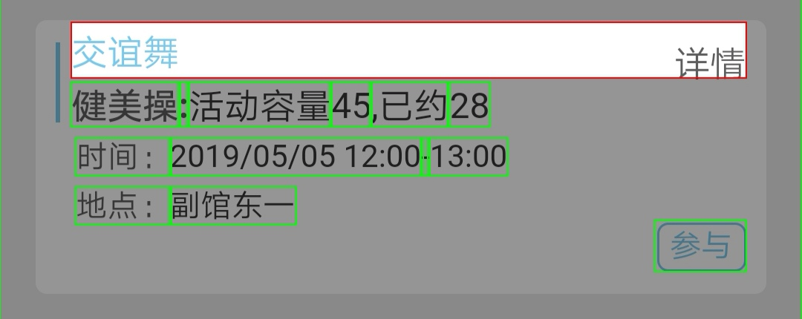
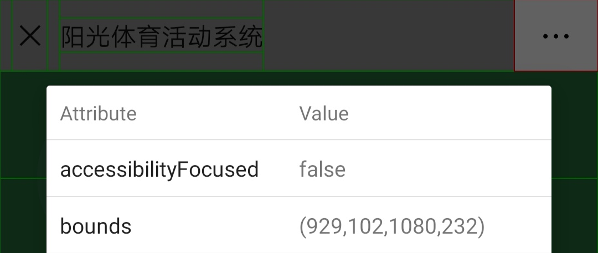
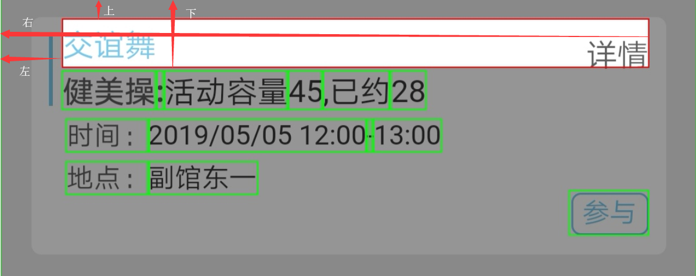
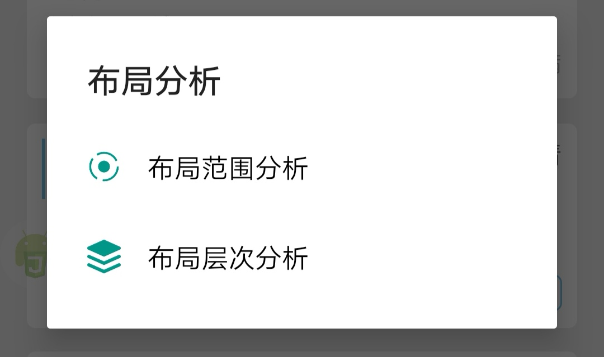

[TOC]

# 简介

基于Auto.js设计的杭州电子科技大学自动体育课约课脚本。能够实现自动约课功能，完美解决乒乓球课抢课的烦恼。


# 使用

正式使用之前，需要手动配置一些参数。这些参数一般分为3大类，**选课参数** ，**跟随设备参数** （因为使用的方法和屏幕的素质有关，不同的设备需要重新测量）以及跟随**微信更新可能会变动的参数** 。

配置一下参数总结起来其实就3步：

1. 测量**跟随屏幕参数** ，把定位做好
2. 检查跟随**微信更新可能会变化的参数**
3. 填写**选课参数**（为了调试不选上课，我在点了“参与”按钮之后点击取消按钮，实际使用中需要改成你手机上实际的按钮）

## 选课参数

`className` 指的是你需要选的课的名称。因为微信神奇的布局，所以后面会有一个空格和“详情”。

`identification` 是配合微信内部搜索功能提交的匹配字段，建议不要和课程的其它字段有重复。比如下面的例子，建议`className` 为“交谊舞 详情”，`identification` 为“健美操”。


以及在代码中所有参数的最下面的`blackList` 参数。改参数的主要功能是删除一些自己不喜欢时间的课，但是加上了这个参数会对选课的性能造成很大的影响，所以，不建议设置很多，个人建议1个时间段就好。该字段用的是正则表达式，所以可以精确到一天中某个时间的课，也可以扩大到某一天的课。

## 跟随设备参数



高亮部分就是`className` 部分，需要定位的部分包括屏幕右上角的三个小点，`时间` 栏的中间最长的部分，以及`参与` 按钮。

`dots` 记录他的bounds值填入数值就好了。



`bounds` 从左到右分别是左，上，右，下，下面是图片演示



`realeticeTime` 是**时间黑名单** 和`className` 的相对距离。

```javascript
/**
 * (96, 1197, 1005, 1272)	className
 * (228, 1353, 570, 1404)	blackList
 * [228, 156, 570, 132]
 * 时间栏第一条与className的相对距离
 */
var raletiveTime = [228, 156, 570, 132];
```

从上面的例子可以看出来**228** 是不变的，因为其本身左边的位置是不会变的，为了简便人和手机的计算，我们就不用更改了。

`raletiveButton` 是`className` 和“参与”按钮的相对距离，解释同上。

windowTop, windowBottom 是显示课程整个区域的**上** 和**下** （不包括上面暗的部分），windowTop不需要精确值，比测量者稍大就行了。


`reFreshButton` 和`searchButton` 点击屏幕右上角的点就能看见，如果你的是中文的则需要改成中文的。


## 跟新更新可能会更新的参数

`inputBoxId` `closeButtonId` `nextItemButtonId`分别指下面的3个按钮，这是微信公众号里面少数保留有ID值的控件了，但是可能隔段时间微信更新就会改ID值，所以要留意。


# 设计介绍

由上一张图片我们可以看到，每一节课没有一个独立的父容器包裹。所以我只能借助查找字段，以及相对的位置来计算其它控件的位置。

```flow
st=>start: 暂停，然后刷新选课页面
cond=>condition: 是否选上两节课
io=>inputoutput: 选课完成
op1=>operation: 刷新页面
op2=>operation: 寻找课程
e=>end: 完成

st(right)->cond(right)
cond(yes)->e
cond(no)->op1(right)->op2(left)
op2(right)->cond
```

由于控件元素的位置不能随着屏幕的移动更新，所以每次向下滑动后，都需要重新获取目标的位置。而且不在显示区域的空间的位置在数值上是卡在屏幕的上下边缘。

# 使用auto.js内置的测量功能

获取坐标使用的是auto.js内置的功能，点击悬浮窗，然后选择蓝色的按钮，接着选则“布局范围分析”，bounds, id等都可以在里面看到




如果，需要学习auto.js的一些用法的话，请查看[官方文档](<https://hyb1996.github.io/AutoJs-Docs/#/>) 

